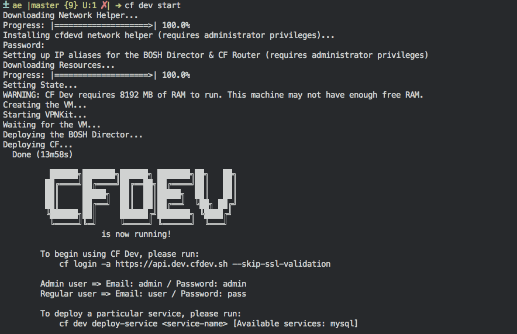

This repository is no longer receiving updates.

---

# CF Dev

***********************************

CF Dev is a distribution of Cloud Foundry designed to run on a developer’s laptop or workstation using native hypervisors and a fully functional BOSH Director. CF Dev gives application developers the full Cloud Foundry experience in a lightweight, easy to install package. CF Dev is intended for application developers who wish to develop and debug their application locally on a full-featured Cloud Foundry. CF Dev is also an excellent getting started environment for developers interested in learning and exploring Cloud Foundry.

## Recommended system requirements

* Operating system: MacOS 10.12+/Windows 10+/Linux (**Note:** Only the `Ubuntu` distro is currently suppported)
* CPU: 2 Cores or more
* Memory: 8 Gigabytes _available memory_
* Disk: 60GB _flash_ storage
* Dependencies: _QEMU_ and _Libvirt_ for Linux
  * Ubuntu: `sudo apt install qemu-kvm libvirt-bin libvirt-doc`

## Getting Started

### Install

1. Install the [CF CLI](https://github.com/cloudfoundry/cli)
1. Install the CF Dev plugin `cf install-plugin -r CF-Community cfdev`
1. Run CF Dev `cf dev start`

_Note: For more installation and configuration options, please see the [FAQ](./FAQ.md#can-i-configure-the-working-directory)._

### Use BOSH

1. Install [BOSH CLI v2](https://bosh.io/docs/cli-v2.html).
1. Set environment variables to point BOSH to your CF Dev instance
	* Unix: `eval "$(cf dev bosh env)"`
	* Windows: `cf dev bosh env | Invoke-Expression`
1. Run BOSH `bosh <command you want to run>`

### Uninstall

To stop CF Dev run `cf dev stop`. This will completely stop and destroy the CF Dev VM.

To uninstall the CF Dev cf CLI plugin run `cf uninstall-plugin cfdev`.

To reclaim consumed disk space, delete your CF Dev directory:

* Unix: `rm -rf ~/.cfdev`
* Windows `Remove-Item -Recurse ~/.cfdev`

## Features

* **Insecure Docker Registries:** Invoke `cf dev start` with the `-r` flag to specify a comma separated list of insecure docker registries that will be
   available for use during the `cf push` process.

* **Proxy Support:** Export `HTTP_PROXY`, `HTTPS_PROXY`, `NO_PROXY` environment variables during your terminal session to have them respected during the start process and _within_
  your CF Dev virtual machine. _Not yet supported on the Linux platform_.

* **Host Access:** Access the host machine from within application containers using the `host.cfdev.sh` domain name.

* **TCP Routing:** You can learn more about TCP Routing from within the Cloud Foundry platform [here](https://github.com/cloudfoundry/routing-release#post-deploy-steps).

## Telemetry

Here on the CF Dev team, we use telemetry to help us understand how our tool is being used.  We value our users privacy, therefore all telemetry is completely anonymous. There is no way for anyone with the telemetry to identify who is using the CF Dev tool.  In an effort to make our data as transparent as possible, we will be publishing aggregated anonymous usage data to this page periodically to help our user community understand how the tool is being used. 

In addition to making this data completely anonymous, we require users to opt-in to allowing us to collect telemetry from their tool. Upon running `$ cf dev start` for the first time, we will prompt the user to opt-in to capturing analytics.  Any time after that you can turn on/off telemetry by running `$ cf dev telemetry --on/off`.

You can learn more about what we do with telemetry [here](https://github.com/cloudfoundry-incubator/cfdev/wiki/Telemetry)

## Community

* [#cfdev on Cloudfoundry Slack](https://cloudfoundry.slack.com)

* [Contributing](CONTRIBUTING.md)

## FAQ

See [FAQ](FAQ.md).
